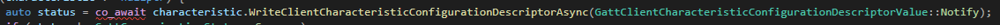
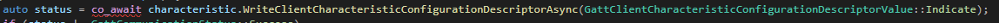
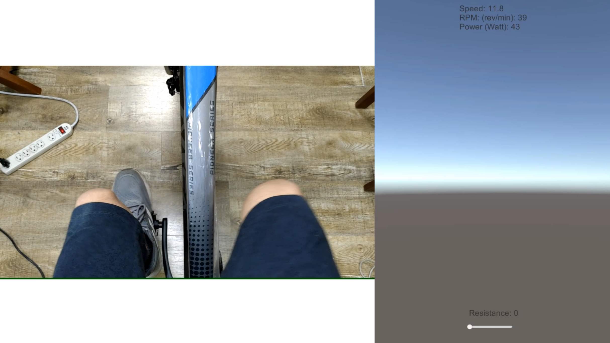

# BLE_FTMS_IndoorBike
 FTMS using BLE to communicate with indoor bike trainer\
 equipment : Xpedo Apx pro\
 Unity : 2021.3.6 (LTS)\
 Visual Studio : 16.11.13 (Release x64)\
 dll project dependency : "MSVC C++ Buildtools", "Windows 10 SDK", ".NET Framework 4.7.2 SDK"\
 This project is based on https://github.com/adabru/BleWinrtDll \
 We modify the write characteristic part to make our trainer work\
  \
 ===> \
 
  \

 In unity project we write some code to let connect function run in coroutine.\
 And we create a simple scene to show the example\

 For our trainer, three kinds of information can be received (speed RPM power)\
 Drag the slider to change the resistance value (note: the value cannot be written too frequently, otherwise it will cause the bluetooth to crash)\
 We have pack codes dll and scene into unitypackge, feel free to use it\
 Also there are an exe zip file for windows, you can quickly test if this project works for you\
 Here is the demo video (recording time difference not cut out)\
 